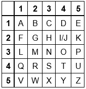
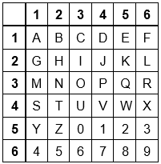

# Exercice 2

## Carré de Polybe

Le carré de Polybe est une technique de chiffrement par substitution ancienne.

Le principe est assez simple, il consiste à ordonner les lettres de l’alphabet en ordre alphabétique dans un tableau carré de 5 cases de côté dont chaque ligne et chaque colonne sont numérotées, de gauche à droite et de haut en bas. Considérant que l’alphabet français comporte 26 lettres et que le carré possède seulement 25 cases, par convention les lettres i et j sont fusionnées - comme dans l’image ci-contre. Parfois, d’autres lettres sont fusionnées à la place de celles-ci comme x et z. 

L’une des variantes consiste à agrandir le carré à 36 cases — soit 6 lignes et 6 colonnes — pour y inclure les chiffres de 0 à 9 à la fin et d’y séparer les lettres i et j, ce qui élimine la confusion lors du déchiffrement du message.

## A réaliser

Ecrire les fonctions `encode_polybe` et `decode_polybe` permettant respectivement d'encoder une chaîne de caractère  et de décoder une chaîne de caractère.
- `encode_polybe` prend en argument une chaîne de caractère claire et retourne la chaîne de caractère correspondant à l'encodage.
- `decode_polybe` prend en argument une chaîne de caractère encodée et retourne la chaîne de caractère en claire.
