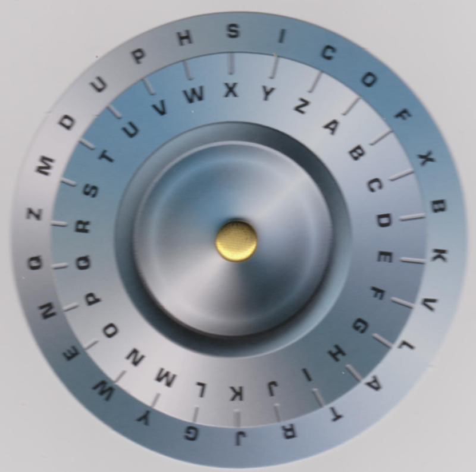

# Exercice 4

Sur les chaînes de caractères, voilà aussi  un exercice de chiffrement/déchiffrement symétrique simple basé sur l'image ci-dessous : 

Alice et Bob, qui désirent communiquer à l'aide de se système, dispose chacun de la roue alignée à l'identique.
Ils auront convenu au préalable comment aligner la roue.
Chaque  caractère d'un message que l'un deux désire échanger avec l'autre est remplacé par un caractère correspondant de la roue intérieur. 
Pour le déchiffrement, la démarche se fait dans l'autre sens.

## A réaliser

L'implémentation qui permettra d'automatiser le chiffrement et le déchiffrement. Votre solution comprendra une série de fonctions. 
Les fonctions que vous aurez identifiées et leur prototype seront discutées en laboratoire.

