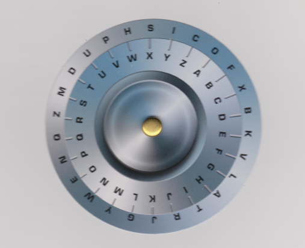

# Exercice 4

Sur les chaînes de caractères, voilà aussi  un exercice de chiffrement/déchiffrement symétrique simple basé sur l'image en pièce jointe : 

chaque  caractère du message à chiffrer  est remplacé par un caractère correspondant de la roue intérieur. 
Pour le déchiffrement, la démarche se fait dans l'autre sens.

L'implémentation comprendra une série de fonctions. 
Les fonctions que vous aurez identifiées et leur prototype seront discutées en laboratoire.

