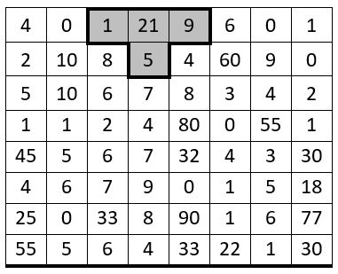

# Exercice 5

Le programme à réaliser doit permettre de gérer, à l'aide d'un menu, les actions suivantes sur une matrice : 
1. Initialiser aléatoirement les valeurs dans la matrice,
1. Afficher les éléments de la matrice si celle-ci a été initialisée,
1. Trouver les T présents dans la matrice si celle-ci a été initialisée.
C'est l'utilisateur qui décide de lancer l'action qu'il désire au moment où il le désire, à vous de gérer les cas impossibles. L'utilisateur doit évidemment pouvoir quitter proprement le programme.

## Spécification du programme

### Menu
Le code du menu doit être écrit dans la partie `main()` du programme. Celui-ci doit demander à l'utilisateur quelle action il veut exécuter et faire appel à la fonction adéquate. Le menu doit attendre qu'une valeur correcte ait été introduite par l'utilisateur pour l'exécuter. Dans le cas contraire, il affiche à nouveau le menu.

### Initialisation
Il faut écrire une fonction nommée `init_matrix` qui va remplir la matrice avec une série de valeurs aléatoires comprises entre `MIN` et `MAX`.

### Affichage
Il faut écrire une fonction nommée `display_matrix` qui va afficher proprement le contenu de la matrice. La fonction d'affichage ne peut être exécutée que si l'initialisation a eu lieu.

### Recherche d'un `T`
Il faut écrire la fonction `search_T` qui va rechercher l'origine de tous les `T` existant dans la matrice initialisée. La fonction retournera le nombre de `T` trouvés. Ce nombre devra être affiché dans le main après l'appel de cette fonction. La position (indice de ligne et indice de colonne du coin supérieur gauche de la croix) devra également être affichée pour l'utilisateur chaque fois qu'un `T` est trouvé. La fonction de recherche ne peut être exécutée que si l'initialisation a eu lieu.

La définition d'un `T` est donnée ci-après.

## Définition d'un `T`

Pour être un `T`, il faut que la valeur de l'élément central (21 dans cet exemple) soit strictement supérieur à la somme des 3 autres éléments formant le `T` (en-dessous, à gauche et à droite).

Un `T` ne peut pas être partiel. Il doit comporter les 4 éléments tels que décrits ci-dessus.

Dans l'exemple ci-contre, 21 est bien strictement supérieur à la somme de 1,9 et 5.

## Informations complémentaires
- Des constantes permettent de gérer les dimensions maximales de la matrice et les bornes MIN et MAX de génération du nombre aléatoire. 
- Les fonctions doivent être écrites pour être génériques et donc réutilisables. Les tests spécifiques à ce programme doivent être gérés en dehors des fonctions (e.g. le fait de savoir si la matrice est initialisée ou non)
- Si une action demandée par l’utilisateur est impossible à exécuter, un message doit être affiché pour l’utilisateur.
