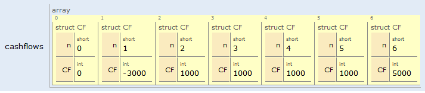

# Exercice 6


L'exercice consiste à réaliser un programme qui doit permettre de calculer la NPV (Net Present Value) d'un projet d'investissement d'une entreprise.

## Exemple
Un projet d’investissement qui démarrerait dans un an avec un investissement de 3000 euros  et qui rapporte ensuite 1000 euros annuellement pendant 4 ans  et la dernière année (année 5) 5000 euros  a une valeur actuelle de 3.439,85 euros (on suppose l’investissement à un taux r=8%).



La formule à utiliser pour calculer la NPV est la suivante
```math

NPV=\sum_{n=0}^{n} \frac{CF{n}}{(1+r)^n}

```

Pour notre exemple, l'application de la formule  donne :
```math
NPV = \frac{-3000}{1.08}+\frac{1000}{(1.08)^{2}}+ \frac{1000}{(1.08)^{3}}+ \frac{1000}{(1.08)^{4}}+ \frac{1000}{(1.08)^{5}}+ \frac{5000}{(1.08)^{6}} = 3.439,85

```

## A réaliser
- Saisie des cash flows et des instants correspondants dans un vecteur
- Saisie du taux d'actualisation employé
- Calcul de la NPV et affichage du résultat dans la console


